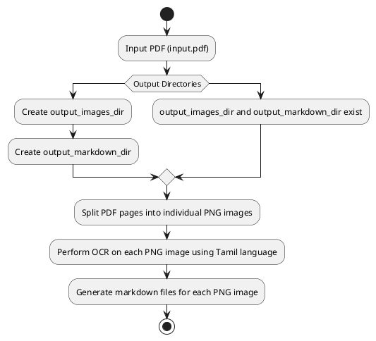

# Converting PDF to PNG Images with OCR using Docker and Tesseract

In this tutorial, we'll explore how to automate the conversion of a Tamil PDF file into individual PNG images, perform Optical Character Recognition (OCR) on the images, and generate Markdown files for each image. We'll achieve this using Docker, Tesseract, and a Bash script.

<!-- more -->

## Prerequisites

- Docker installed on your machine.

## Step 1: Setup Docker Environment

We'll start by setting up our Docker environment to run Tesseract. Let's create the necessary files.

### Dockerfile

Create a `Dockerfile` in your project directory with the following content:

```Dockerfile
# Use an official Tesseract image as the base image
FROM tesseractshadow/tesseract4re
RUN sudo apt update
RUN apt clean
RUN apt-get install -y poppler-utils
# Set the working directory
WORKDIR /app

# Copy the input image to the working directory
COPY ./process.sh  ./process.sh

# Give execute permission to the script
RUN chmod +x /app/process.sh

```

### docker-compose.yml

Create a `docker-compose.yml` file with the following content:

```yaml
version: '3'
services:
  ocr:
    build:
      context: .
    volumes:
      - ./:/app
    command: ["tail", "-f", "/dev/null"]
```

## Step 2: Create the Bash Script

Create a `process.sh` script in your project directory with the following content:

```bash
#!/bin/bash

# Check for command-line arguments
if [[ $# -ne 2 ]]; then
    echo "Usage: $0 <input_pdf> <output_path>"
    exit 1
fi

# Input PDF file with sluggified name and path
input_pdf=$(basename "${1// /_}")                # Get the base name of the input PDF
input_pdf="${input_pdf//[^a-zA-Z0-9_.-]/}"       # Remove special characters from the base name

# Output directories for PNG images and Markdown files with sluggified paths
output_images_dir=$(basename "${2// /_}")               # Get the base name of the output directory
output_images_dir="${output_images_dir//[^a-zA-Z0-9_.-]/}"_images  # Create output_images_dir by appending "_images"
output_markdown_dir=$(basename "${2// /_}")             # Get the base name of the output directory
output_markdown_dir="${output_markdown_dir//[^a-zA-Z0-9_.-]/}"_markdown # Create output_markdown_dir by appending "_markdown"

# Create output directories if they don't exist
mkdir -p "$output_images_dir" "$output_markdown_dir"

# Split PDF pages into individual PNG images and name them with the format
pdftoppm -png "$1" "$output_images_dir/${input_pdf%.*}"_page

# Perform OCR on each PNG image using Tamil language
for png_file in "$output_images_dir"/*.png; do
    base_name=$(basename "$png_file" .png)
    tesseract "$png_file" "$output_markdown_dir/${base_name}" -l tam
done

# Generate markdown files for each PNG image
for png_file in "$output_images_dir"/*.png; do
    base_name=$(basename "$png_file" .png)
    markdown_file="$output_markdown_dir/${base_name}.md"
    title="page-${base_name##*-}"               # Extract the page number from the PNG file name
    pageTitle="Title of $title"

    echo "---" > "$markdown_file"
    echo "title: $title" >> "$markdown_file"
    echo "pageTitle: $pageTitle" >> "$markdown_file"
    echo "---" >> "$markdown_file"
    echo "" >> "$markdown_file"
done

echo "OCR and Markdown generation completed."

```

This Bash script performs a series of steps to automate the conversion of a PDF file into individual PNG images, perform OCR using Tesseract, and generate Markdown files for each image. Here's a breakdown of the script with detailed comments:

1. **Command-line Argument Check:**
   - Checks if the script is called with exactly two command-line arguments: `<input_pdf>` and `<output_path>`.
   - Exits with an error message if the argument count is incorrect.

2. **Input PDF Processing:**
   - Retrieves the base name of the input PDF file.
   - Removes special characters from the base name to create a sluggified input PDF name.

3. **Output Directories Creation:**
   - Retrieves the base name of the output directory.
   - Appends "_images" to create the `output_images_dir` name.
   - Appends "_markdown" to create the `output_markdown_dir` name.
   - Creates the output directories if they don't exist.

4. **PDF to PNG Conversion:**
   - Splits the input PDF into individual PNG images.
   - Names the images with the sluggified input PDF name followed by "_page".

5. **Perform OCR and Generate Markdown:**
   - Iterates through each PNG image in the `output_images_dir`.
   - Performs OCR on each PNG image using the Tamil language.
   - Generates a Markdown file for each PNG image, naming it with the page number extracted from the PNG file name.

6. **Completion Message:**
   - Prints a message indicating that the OCR and Markdown generation process is completed.

This script streamlines the entire process using Docker and Tesseract, making it easy to convert PDF files into PNG images with OCR and generate associated Markdown files.

## Step 3: docker-compose up

```bash
docker-compose up --build
```

## Step 4: Run the Conversion


1. Place your PDF file named `input.pdf` in the `input` directory.
2. Open a docker terminal and navigate to the project directory.
3. Run the following command to automate the conversion process

```bash
./process.sh "./input/input.pdf" ./results
```

4. The process will split the PDF, convert pages to PNG images, perform OCR, and generate Markdown files. The results will be saved in the output directory given as command line arguments; the `.png` and `.md` will be saved into separate directories dynamically created based on the input file name.

## Process Flow Diagram

Below is a PlantUML diagram illustrating the flow of the `process.sh` script:



## Conclusion

By following this tutorial, you've learned how to automate the conversion of a PDF file into individual PNG images, perform OCR using Tesseract, and generate Markdown files for each image using Docker. This process can save you time and effort when dealing with large volumes of text-based content.

Feel free to adapt this approach to other languages supported by `tessaract` or requirements. Happy coding!
